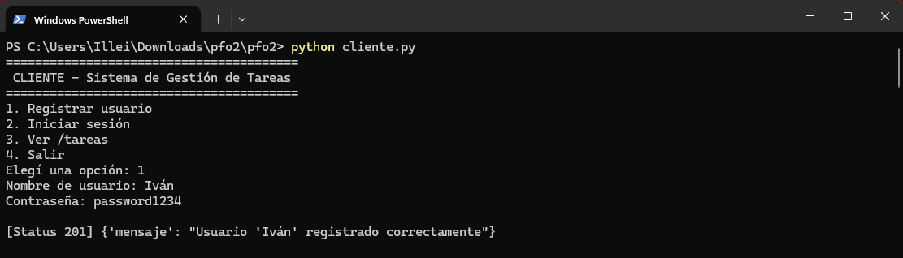
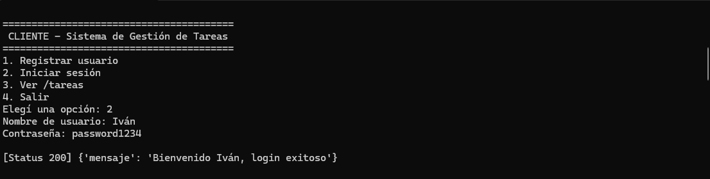
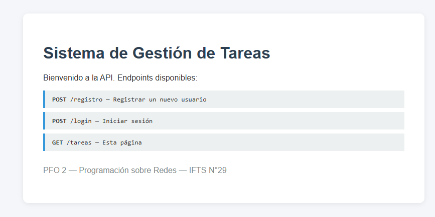
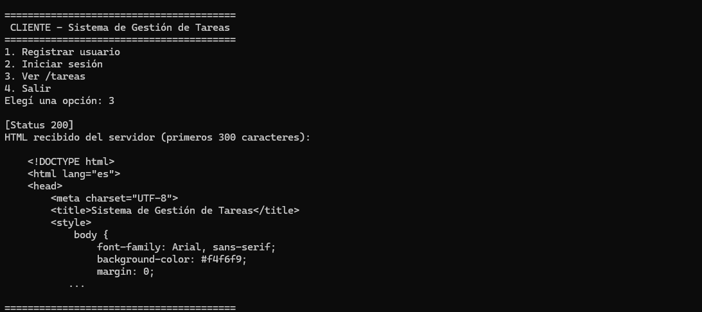

# PFO 2: Sistema de Gestión de Tareas con API y Base de Datos

**Materia:** Programación sobre Redes
**Instituto:** IFTS N°29 — Tecnicatura Superior en Desarrollo de Software
**Cuatrimestre:** 1° C 2026

---

## Descripción

API REST desarrollada en **Flask** con persistencia en **SQLite** que implementa:

- Registro de usuarios con contraseñas hasheadas.
- Inicio de sesión con verificación de credenciales.
- Endpoint `/tareas` que devuelve una página HTML de bienvenida.
- Cliente de consola para interactuar con la API.

---

## Estructura del proyecto

```
pfo2/
├── servidor.py        # API Flask + SQLite
├── cliente.py         # Cliente de consola
├── requirements.txt   # Dependencias
└── README.md          # Este archivo
```

La base de datos `tareas.db` se crea automáticamente al ejecutar el servidor.

---

## Requisitos

- Python 3.8 o superior
- pip

---

## Cómo ejecutar el proyecto

### 1. Clonar el repositorio

```bash
git clone https://github.com/<tu-usuario>/pfo2.git
cd pfo2
```

### 2. (Opcional pero recomendado) Crear un entorno virtual

```bash
python -m venv venv
# En Linux/Mac:
source venv/bin/activate
# En Windows:
venv\Scripts\activate
```

### 3. Instalar dependencias

```bash
pip install -r requirements.txt
```

### 4. Levantar el servidor

```bash
python servidor.py
```

El servidor queda escuchando en `http://localhost:5000`.

### 5. (En otra terminal) Probar con el cliente de consola

```bash
python cliente.py
```

---

## Endpoints de la API

| Método | Endpoint   | Descripción                                  |
|--------|------------|----------------------------------------------|
| POST   | `/registro`| Registra un usuario nuevo                    |
| POST   | `/login`   | Verifica credenciales                        |
| GET    | `/tareas`  | Muestra una página HTML de bienvenida        |

### Ejemplos con `curl`

**Registrar usuario:**
```bash
curl -X POST http://localhost:5000/registro \
  -H "Content-Type: application/json" \
  -d '{"usuario":"alan","contraseña":"1234"}'
```
Respuesta:
```json
{ "mensaje": "Usuario 'alan' registrado correctamente" }
```

**Login:**
```bash
curl -X POST http://localhost:5000/login \
  -H "Content-Type: application/json" \
  -d '{"usuario":"alan","contraseña":"1234"}'
```
Respuesta:
```json
{ "mensaje": "Bienvenido alan, login exitoso" }
```

**Ver página de tareas:**
```bash
curl http://localhost:5000/tareas
```
O abrir en el navegador: <http://localhost:5000/tareas>

---

## Capturas de pruebas exitosas

> Reemplazar estas capturas por las propias después de probar.

### Registro exitoso


### Login exitoso


### Página /tareas en el navegador


### Cliente de consola en acción


---

## Preguntas PFO

### ¿Por qué hashear contraseñas?

Hashear contraseñas significa transformarlas con una función criptográfica
de una sola vía: a partir del hash no se puede reconstruir la contraseña
original. Esto se hace por varios motivos:

- **Protección ante filtraciones:** si un atacante logra acceder a la base
  de datos, no obtiene las contraseñas reales, solo los hashes. No puede
  iniciar sesión con esa información directamente.
- **Privacidad del usuario:** muchas personas reutilizan contraseñas en
  distintos servicios. Si el sistema guardara las contraseñas en texto
  plano y se filtrara, comprometería las cuentas del usuario en otras
  plataformas.
- **Buenas prácticas de seguridad:** guardar contraseñas en texto plano
  es una mala práctica reconocida (OWASP la incluye en su lista de
  vulnerabilidades comunes). Las librerías modernas como `werkzeug.security`
  usan algoritmos robustos (scrypt, bcrypt, pbkdf2) que además incluyen
  *salt* para defender contra ataques de diccionario y *rainbow tables*.

En este proyecto se usa `generate_password_hash()` de Werkzeug, que genera
un hash con scrypt y salt aleatorio, y `check_password_hash()` para
verificar la contraseña sin necesidad de descifrarla.

### Ventajas de usar SQLite en este proyecto

- **Sin servidor adicional:** SQLite es una base de datos embebida, no
  requiere instalar ni configurar un servidor aparte (como sí pasa con
  MySQL o PostgreSQL). Toda la base vive en un único archivo (`tareas.db`).
- **Fácil distribución:** el archivo `.db` se mueve junto al proyecto.
  Esto facilita el desarrollo y las pruebas locales.
- **Liviana y rápida:** para una aplicación con pocos usuarios y operaciones
  simples (CRUD básico), el rendimiento de SQLite es más que suficiente.
- **Cero configuración:** no hay usuarios, permisos, ni puertos que
  configurar. Funciona apenas se importa la librería `sqlite3`, incluida en
  la librería estándar de Python.
- **Soporte de SQL estándar:** permite usar las mismas consultas que en
  otros motores, lo que facilita una eventual migración a PostgreSQL/MySQL
  si el proyecto crece.

---

## Nota sobre GitHub Pages

GitHub Pages solo sirve archivos estáticos (HTML, CSS, JS), por lo que
**no puede ejecutar el servidor Flask**. Lo que se publica en GitHub Pages
es esta documentación del proyecto (este README renderizado). El servidor
debe ejecutarse localmente con `python servidor.py` siguiendo las
instrucciones de arriba.

Para activar GitHub Pages en el repo:
1. Subir el proyecto a GitHub.
2. Ir a *Settings* → *Pages*.
3. En *Source* seleccionar `Deploy from a branch`, branch `main`, folder `/ (root)`.
4. Guardar. El README se publica como página principal.

---

## Autor

Iván Luis Leiva, 3° B — Programación sobre Redes — IFTS N°29
